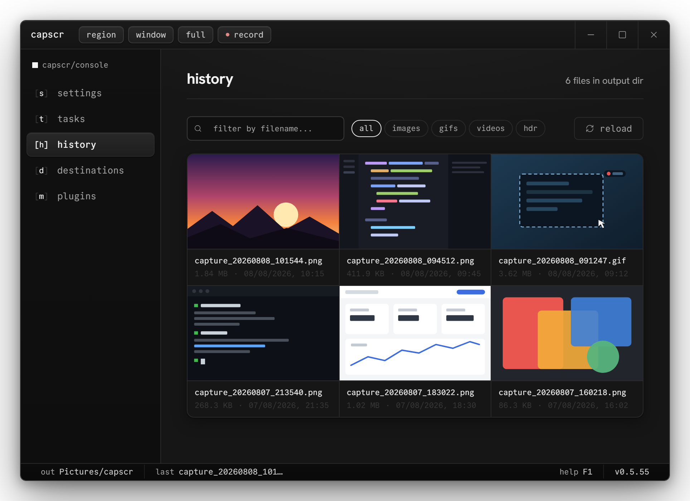
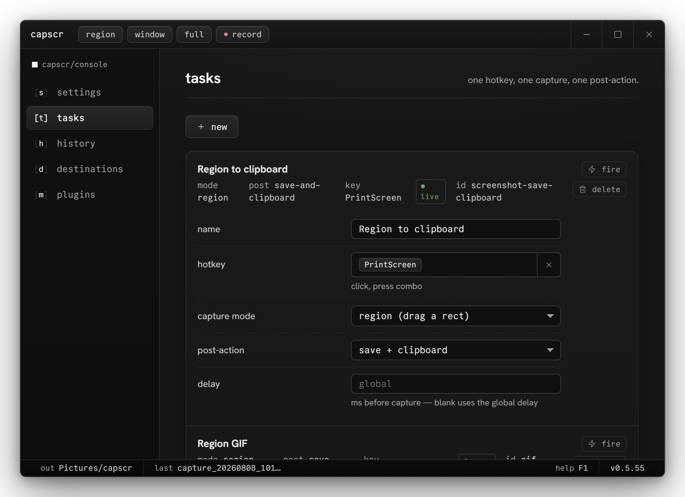

# capscr

HDR-aware screen capture for Windows and Linux. Tray-first, signed updates, no telemetry.





- homepage: [rot.lt/work/capscr](https://rot.lt/work/capscr)
- plugins: [rot.lt/work/capscr/plugins](https://rot.lt/work/capscr/plugins), registry at [`zeo/capscr-plugins`](https://github.com/zeo/capscr-plugins)
- downloads: [GitHub Releases](https://github.com/zeo/capscr/releases)
- license: MIT

## features

Every hotkey is a task: a capture mode (region, region-last, window, fullscreen, active monitor, region GIF, region MP4) plus a post-action (save, clipboard, editor, upload, OCR). Bind as many as you want in the hub.

The selection overlay does region drag, window click, Enter for fullscreen, and `Alt+click` to copy a pixel's `#RRGGBB`. Live size readout, 8x loupe, window-snap highlight.

HDR capture (Windows) goes through Windows.Graphics.Capture FP16 with an ICtCp luminance-only tonemap and per-monitor SDR-white detection. Output is SDR PNG, or HDR-preserved PNG (PQ cICP / HLG). Linux compositors don't expose HDR pixels to capture clients yet, so Linux captures are SDR.

Recording produces GIF or H.264 MP4 (ffmpeg, auto-downloaded and sha256-verified on Windows; system ffmpeg on Linux), with a live timer and stop control drawn outside the captured area.

Uploads go to Imgur, custom HTTPS POST, SFTP, or S3. Destinations pass SSRF checks (DNS double-resolve, private-IP rejection), and stored passwords live in the platform credential vault (DPAPI / Secret Service), never on disk in cleartext. Plain FTP is rejected because it leaks credentials in transit.

Updates are in-place, Minisign-signed, through the shared rot installer. deb and rpm installs update through the system package manager.

## install

Grab a file from the [releases page](https://github.com/zeo/capscr/releases/latest):

| file | use |
|---|---|
| `capscr-x.x.x-online-setup.exe` | signed Windows bootstrapper, downloads the verified package |
| `capscr-x.x.x-offline-setup.exe` | signed Windows installer, package embedded |
| `capscr-x.x.x-linux-x86_64-setup` | Linux bootstrapper |
| `capscr-x.x.x-linux-x86_64-offline-setup` | Linux offline installer |
| `capscr_x.x.x_amd64.deb` | Debian / Ubuntu / Mint |
| `capscr-x.x.x-1.x86_64.rpm` | Fedora / openSUSE |
| `capscr_x.x.x_amd64.AppImage` | any glibc 2.39+ distro; `chmod +x` and run |

Needs Windows 10 1903+, or a Linux desktop with webkit2gtk 4.1 and glibc 2.39+. MP4 recording uses `ffmpeg`, OCR uses `tesseract`, X11 file-clipboard uses `xclip`; the deb and rpm pull these in as recommends.

X11 and Wayland both work. Wayland picks a pixel source per compositor (KWin ScreenShot2, `ext-image-copy-capture` on wlroots, portals on GNOME):

| feature | X11 | KDE Wayland | wlroots Wayland | GNOME Wayland |
|---|---|---|---|---|
| capture, editor, upload, GIF + MP4 | ✅ | ✅ | ✅ | ✅ |
| window picking | capscr overlay | KWin picker | capscr overlay | portal picker |
| keyboard global hotkeys | ✅ | ✅ | portal, else Advanced input | ✅ |
| mouse side-button hotkeys | Advanced input | Advanced input | Advanced input | Advanced input |
| recording bar above fullscreen | ✅ | ✅ | ✅ | best-effort |
| tray icon | ✅ | ✅ | depends on host | needs AppIndicator |
| HDR-preserved capture | no | no | no | no |

Advanced input (Settings → hotkeys) reads `/dev/input` directly and needs the `input` group; it covers mouse buttons everywhere and keyboards on portalless compositors. The "no" row needs compositor-side changes, written up in [`docs/platform-limits.md`](docs/platform-limits.md).

## default hotkeys

| hotkey | action |
|---|---|
| set on first launch | region → save + clipboard |
| `Ctrl+Shift+G` | region GIF → save |
| `Ctrl+Shift+V` | region MP4 → save |

All rebindable in the Tasks tab.

## configuration

`%APPDATA%\capscr\capscr\config\config.toml` on Windows, `~/.config/capscr/config.toml` on Linux. The hub edits everything, but the file is plain TOML:

```toml
[capture.hdr]
brightness_nits = 0.0        # SDR-white override; 0 = auto-detect
user_brightness_scale = 1.0  # pre-tonemap exposure multiplier

[upload]
destination = "Imgur"        # or "Custom" / "Sftp" / "S3"
copy_url_to_clipboard = true

[upload.sftp]
host = "files.example.com"
port = 22
username = "user"
password = "secret"          # moved into the credential vault on first save
remote_dir = "/screenshots"
public_url_template = "https://files.example.com/{filename}"
```

SFTP takes Ed25519 and ECDSA keys via `private_key_path`. RSA is off until RUSTSEC-2023-0071 is resolved upstream.

## build from source

Rust 1.94+, Node 22.12+, MSVC build tools on Windows or the webkit2gtk stack on Linux.

```sh
git clone https://github.com/zeo/capscr.git
cd capscr
npm --prefix frontend ci
cargo install tauri-cli --version "^2" --locked
cargo tauri build
```

Debian/Ubuntu build dependencies:

```sh
sudo apt install build-essential curl wget file pkg-config libssl-dev \
  libgtk-3-dev libwebkit2gtk-4.1-dev libayatana-appindicator3-dev \
  librsvg2-dev libxdo-dev libclang-dev libxcb1-dev libxcb-shm0-dev \
  libxcb-randr0-dev libxrandr-dev libdbus-1-dev libpipewire-0.3-dev \
  libwayland-dev libegl-dev libgbm-dev libdrm-dev
```

Release builds sign packages and manifests with `TAURI_SIGNING_PRIVATE_KEY` / `TAURI_SIGNING_PRIVATE_KEY_PASSWORD`.

## plugins

The plugins tab browses [`rot.lt/capscr/registry.json`](https://rot.lt/capscr/registry.json), verifies each zip's sha256, and installs into the app data dir. WASM plugins get `on_capture`, `on_capture_saved`, and `on_upload_success` hooks with capability-gated host imports; see [`docs/plugin-runtime.md`](docs/plugin-runtime.md) and the publishing contract in [`docs/marketplace.md`](docs/marketplace.md).

## credits

The HDR tonemap in `src/capture/tonemapping.rs` is a Rust port of the SKIV ICtCp luminance-only tonemap by Andon "Kaldaien" Coleman (MIT): https://github.com/SpecialKO/SKIV. Per-frame MaxCLL / P99 logic adapted from GotoFinal's HDR tonemap reference (MIT).

## license

MIT, see [LICENSE](LICENSE).
